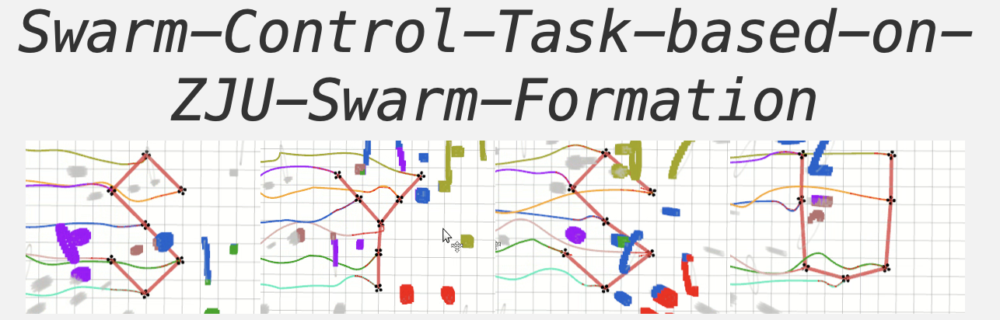
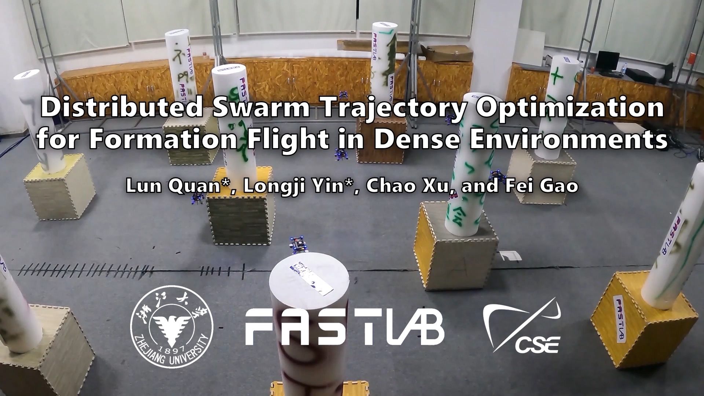

<div align=center>

</div> 

## 指引

## 运行

1. 编译

   ```
   catkin_make
   ```

2. 设置环境变量

   ```
   source devel/setup.bash
   ```

3. 启动rviz

   ```
   roslaunch ego_planner rviz.launch
   ```

4. 运行节点

   ```
   roslaunch ego_planner normal_hexagon.launch
   ```

5. 运行goal.py

   ```
   python3 goal.py
   ```

## Reference


