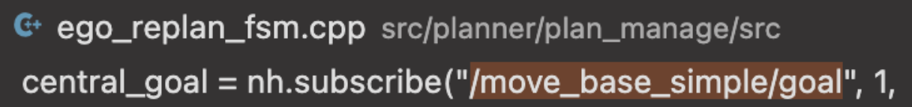

## Quick Start

**step 1：compile**

```shell
git clone -b v2.0 git@github.com:MOEA-LAB/Swarm-Control-Course-Additional-Work.git
cd Swarm-Control-Course-Additional-Work
catkin_make
```

**step2: setup rviz**

```shell
./setup.sh
```

**step3: run main node**

```shell
./run.sh
```

**step4: publish goal**

```shell
./publish.sh
```


## 怎么写？

为了实现sysu，那么首先就是要根据SYU三个字母进行描点，在这里我使用了MATLAB进行点的绘制，代码如下,在`draw.m`文件里面：

```matlab
% MATLAB代码

% 清空所有图形、变量和控制台
clc;
clear;
close all;

% 定义x和y的范围
x_range = [-1.8, 1.8];
y_range = [-2, 2];

% 创建一个图形窗口
figure;
hold on;
axis([x_range, y_range]);
grid on;

% 初始化一个空数组来存储点的位置
points = zeros(7, 2);

% 提示用户点击九个点
disp('请在图形上点击九个点。');

% 循环九次获取用户点击的点
for i = 1:7
    [x, y] = ginput(1); % 获取点击的点
    plot(x, y, 'ro'); % 显示点击的点
    points(i, :) = [x, y]; % 将点的位置存储到数组中
    text(x, y, sprintf('(%0.2f, %0.2f)', x, y), 'VerticalAlignment', 'bottom', 'HorizontalAlignment', 'right'); % 显示坐标
end

% 显示所有点击的点的位置
disp('点击的点的位置：');
disp(points);

% 将点的位置列表返回
points
```

然后这里你自己截个图，描七个点，然后返回相对坐标，然后把SYSU四个字母都描出来之后，进行微调，然后就得到了如下的点，

```xml
  relative_pos_s10: {x: 0.000, y: 0.00, z: 0.0}
  relative_pos_s11: {x: 0.8000, y: 0.7500, z: 0.0}
  relative_pos_s12: {x: 0.0000, y: 1.5200, z: 0.0}
  relative_pos_s13: {x: -0.7600, y: 0.7300, z: 0.0}
  relative_pos_s14: {x: 0.7700, y: -0.7600, z: 0.0}
  relative_pos_s15: {x: 0.0000, y: -1.4900, z: 0.0}
  relative_pos_s16: {x: -0.7600, y: -0.7500, z: 0.0}

  relative_pos_y0: {x: -0.4900, y: 0.5100, z: 0.0}
  relative_pos_y1: {x: 0.5000, y: 0.5000, z: 0.0}
  relative_pos_y2: {x: 1.0200, y: 1.0200, z: 0.0}
  relative_pos_y3: {x: -1.0000, y: 1.0300, z: 0.0}
  relative_pos_y4: {x: 0.0000, y: -0.6800, z: 0.0}
  relative_pos_y5: {x: 0.0000, y: -1.4700, z: 0.0}
  relative_pos_y6: {x: 0.000, y: 0.00, z: 0.0}

  relative_pos_s20: {x: 0.000, y: 0.00, z: 0.0}
  relative_pos_s21: {x: 0.8000, y: 0.7500, z: 0.0}
  relative_pos_s22: {x: 0.0000, y: 1.5200, z: 0.0}
  relative_pos_s23: {x: -0.7600, y: 0.7300, z: 0.0}
  relative_pos_s24: {x: -0.7600, y: -0.7500, z: 0.0}
  relative_pos_s25: {x: 0.0000, y: -1.4900, z: 0.0}
  relative_pos_s26: {x: 0.7700, y: -0.7600, z: 0.0}
  
  relative_pos_u0: {x: -1.0000, y: 0.500, z: 0.0}
  relative_pos_u1: {x: 1.000, y: 0.500, z: 0.0}
  relative_pos_u2: {x: 1.0100, y: 1.500, z: 0.0}
  relative_pos_u3: {x: -0.9800, y: 1.500, z: 0.0}
  relative_pos_u4: {x: 0.900, y: -1.0000, z: 0.0}
  relative_pos_u5: {x: 0.0000, y: -1.2400, z: 0.0}
  relative_pos_u6: {x: -0.900, y: -1.0000, z: 0.0}
```

因为观察到了六边形的相对位置是存放在`src/planner/plan_manage/config/normal_hexagon.yaml`文件里面的，很自然地就想到把这些点都替换到该文件下。

但是这些都是roslaunch里面调用的参数，因此为了能够读取这些参数，我还在`src/planner/plan_manage/src/ego_replan_fsm.cpp`里面找到了读取的位置，我把原来的读取六边形的代码：

```cpp
 for (int i = 0; i < 7; i++)
  {
    nh.param("global_goal/relative_pos_" + to_string(i) + "/x",
             swarm_relative_pts_[i][0], -1.0);
    nh.param("global_goal/relative_pos_" + to_string(i) + "/y",
             swarm_relative_pts_[i][1], -1.0);
    nh.param("global_goal/relative_pos_" + to_string(i) + "/z",
             swarm_relative_pts_[i][2], -1.0);
  }
```

改成了如下，那就可以顺利读取SYSU四个字母的编码了

```cpp
 for (int i = 0; i < 7; i++)
  {
    nh.param("global_goal/relative_pos_y" + to_string(i) + "/x",
             swarm_relative_pts_y_[i][0], -1.0);
    nh.param("global_goal/relative_pos_y" + to_string(i) + "/y",
             swarm_relative_pts_y_[i][1], -1.0);
    nh.param("global_goal/relative_pos_y" + to_string(i) + "/z",
             swarm_relative_pts_y_[i][2], -1.0);
  }

  for (int i = 0; i < 7; i++)
  {
    nh.param("global_goal/relative_pos_s1" + to_string(i) + "/x",
             swarm_relative_pts_s1_[i][0], -1.0);
    nh.param("global_goal/relative_pos_s1" + to_string(i) + "/y",
             swarm_relative_pts_s1_[i][1], -1.0);
    nh.param("global_goal/relative_pos_s1" + to_string(i) + "/z",
             swarm_relative_pts_s1_[i][2], -1.0);
  }
  for (int i = 0; i < 7; i++)
  {
    nh.param("global_goal/relative_pos_s2" + to_string(i) + "/x",
             swarm_relative_pts_s2_[i][0], -1.0);
    nh.param("global_goal/relative_pos_s2" + to_string(i) + "/y",
             swarm_relative_pts_s2_[i][1], -1.0);
    nh.param("global_goal/relative_pos_s2" + to_string(i) + "/z",
             swarm_relative_pts_s2_[i][2], -1.0);
  }
  for (int i = 0; i < 7; i++)
  {
    nh.param("global_goal/relative_pos_u" + to_string(i) + "/x",
             swarm_relative_pts_u_[i][0], -1.0);
    nh.param("global_goal/relative_pos_u" + to_string(i) + "/y",
             swarm_relative_pts_u_[i][1], -1.0);
    nh.param("global_goal/relative_pos_u" + to_string(i) + "/z",
             swarm_relative_pts_u_[i][2], -1.0);
  }
```

因为这个程序最开始的demo是，目标点点击在哪里，那个编队就会飞行到哪里，那么我使用rostopic echo命令监控了一下话题之后，发现了那个2d nav goal的工具发送的话题是`move_base_simple/goal`，然后看了一下这个话题的回调函数，可以找到一个地方



首先第一个central_goal的订阅者回调函数`formationWaypointCallback`是设置目标点，很显然，这里是需要修改的要把那个relative_pos的值进行修改，为此我设计了一个计数器，然后每次点击的就会飞出一个单独的形状，根据上面读取的参数，我把这个相对位置的函数改成了

```cpp
if (times == 0)
  {
    swarm_central_pos_(0) = -9;
    relative_pos << swarm_relative_pts_s1_[id][0], swarm_relative_pts_s1_[id][1],
        swarm_relative_pts_s1_[id][2];
  }
  else if (times == 1)
  {
    swarm_central_pos_(0) = -3;
    relative_pos << swarm_relative_pts_y_[id][0], swarm_relative_pts_y_[id][1],
        swarm_relative_pts_y_[id][2];
  }
  else if (times == 2)
  {
    swarm_central_pos_(0) = 8;
    relative_pos << swarm_relative_pts_s2_[id][0], swarm_relative_pts_s2_[id][1],
        swarm_relative_pts_s2_[id][2];
  }
  else if (times == 3)
  {
    swarm_central_pos_(0) = 18;
    relative_pos << swarm_relative_pts_u_[id][0], swarm_relative_pts_u_[id][1],
        swarm_relative_pts_u_[id][2];
  }
  else
  {
    return;
  }
```

这里其实还考虑到了，由于有时候定义目标点的时候程序会崩溃，那么我就预先设定了几个可行的点（-9,0,0.5）,（-3,0,0.5）,（8,0,0.5）,（18,0,0.5）作为目标点赋值给` swarm_central_pos_`变量里面，也就是说我现在再试用rviz里面的2d nav goal之后，他只作为一个触发器，而并不提供位置信息，这样可以让我的程序在每次飞行中都尽可能飞出一致的路线。

接下来，是关于连线问题，因为由于不是六边形了，所以连线非常混乱，于是在rviz里面观察了一下这些连线的话题，然后顺势就找到了一个文件名字为`planning_visualization.cpp`。然后在里面观察到了一个关键代码如下：

```cpp
geometry_msgs::Point p, q;
    p.x = swarm_odom[line_begin_[i]](0);
    p.y = swarm_odom[line_begin_[i]](1);
    p.z = swarm_odom[line_begin_[i]](2);

    q.x = swarm_odom[line_end_[i]](0);
    q.y = swarm_odom[line_end_[i]](1);
    q.z = swarm_odom[line_end_[i]](2);
    line_strip.points.push_back(p);
    line_strip.points.push_back(q);
```

这个是连线的代码，也就说只要修改了这个line_begin_还有line_end就可以修改连线代码了，所以我就设计了一个回调函数接受`move_base_simple/goal`的信息，每次接收到就吧这个line_begin和line_end进行修改，如下：

```cpp
void PlanningVisualization::turnCallback(const geometry_msgs::PoseStampedPtr &msg)
{
  times++;
  if (times == 1) /* S */
  {
    line_size_ = 6;
    line_begin_.resize(line_size_);
    line_end_.resize(line_size_);
    line_begin_ = {1, 2, 3, 0, 4, 5};
    line_end_ = {2, 3, 0, 4, 5, 6};
  }
  else if (times == 2) /* Y */
  {
    line_size_ = 6;
    line_begin_.resize(line_size_);
    line_end_.resize(line_size_);
    line_begin_ = {3, 0, 6, 1, 4, 5};
    line_end_ = {0, 6, 1, 2, 6, 4};
  }
  else if (times == 3) /* Y */
  {
    line_size_ = 6;
    line_begin_.resize(line_size_);
    line_end_.resize(line_size_);
    line_begin_ = {1, 2, 3, 0, 4, 5};
    line_end_ = {2, 3, 0, 6, 5, 6};
  }
  else if (times == 4) /* U */
  {
    line_size_ = 6;
    line_begin_.resize(line_size_);
    line_end_.resize(line_size_);
    line_begin_ = {3, 0, 6, 5, 4, 1};
    line_end_ = {0, 6, 5, 4, 1, 2};
  }
  else
  {
    return;
  }
  return;
}
```

然后为了让我的飞行更加连贯，然后2d goal其实只是作为一个触发器，因此我记录了每次编队飞行的时间，然后写了个sh文件，便于飞行更加连贯且效果更好：

```shell
#!/bin/bash

# Function to send the message to the ROS topic
send_message() {
  local message=$1
  rostopic pub -1 /move_base_simple/goal geometry_msgs/PoseStamped "$message"
}

# Define the message content (modify as needed)
MESSAGE_CONTENT="header:
  seq: 0
  stamp:
    secs: 0
    nsecs: 0
  frame_id: ''
pose:
  position:
    x: 1.0
    y: 1.0
    z: 1.0
  orientation:
    x: 0.0
    y: 0.0
    z: 0.0
    w: 1.0"

# Send the first message
echo "First message sent"
send_message "$MESSAGE_CONTENT"
sleep 6

# Send the second message
echo "Second message sent"
send_message "$MESSAGE_CONTENT"
sleep 5

# Send the third message
echo "Third message sent"
send_message "$MESSAGE_CONTENT"
sleep 7

# Send the fourth message
echo "Fourth message"
send_message "$MESSAGE_CONTENT"
```

最后贴上demo视频（晚点录）
