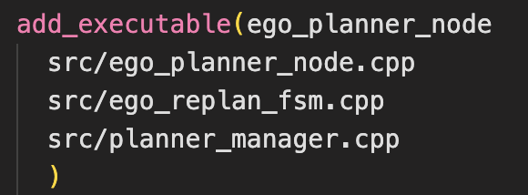

## Quick Start

**step 1：compile**

```shell
git clone git@github.com:MOEA-LAB/Swarm-Control-Course-Additional-Work.git
cd Swarm-Control-Course-Additional-Work
catkin_make
```

**step2: setup rviz**

```shell
./setup.sh
```

**step3: run main node**

```shell
./run.sh
```

**step4: publish goal**

```python
sudo chmod +x goal.py
python3 goal.py
```


## 怎么写？

首先在normal_hexagon.launch文件中发现是在这里启动了6个`run_in_sim.launch`的无人机节点，因此为了找到单个无人机的位置，那就需要在该文件里面找对应的节点，在advanced_param.xml里面，发现了`drone_$(arg drone_id)_ego_planner_node`，那就说明这里就是主要的节点。经过搜索可以找到该节点的CMakeLists文件在`src/planner/plan_manage/CMakeLists.txt`（**自己截个图，一定要自己截图，或者主题不一样显示也不一样！！！！**）



那么就可以确定，无人机的飞行节点肯定是在这几个cpp文件里面。经过全局搜索，找到了main函数在ego_planner_node.cpp文件里面，也就是路径：src/planner/plan_manage/src/ego_planner_node.cpp（截图截图截图）

```cpp
int main(int argc, char **argv)
{

  ros::init(argc, argv, "ego_planner_node");
  ros::NodeHandle nh("~");

  EGOReplanFSM rebo_replan;

  rebo_replan.init(nh);

  // ros::Duration(1.0).sleep();
  ros::spin();

  return 0;
}
```

可以看到主要的函数就是这一行（截图）

```cpp
rebo_replan.init(nh);
```

那我们继续找这个init的函数，经过全局搜索，在`ego_replan_fsm.cpp`里面找到了它的定义：

（**我建议把下面的代码块放到vscode里面截图**！！！）

```cpp
  for (int i = 0; i < 7; i++)
  {
    nh.param("global_goal/relative_pos" + to_string(i) + "/x",
             swarm_relative_pts_[i][0], -1.0);
    nh.param("global_goal/relative_pos" + to_string(i) + "/y",
             swarm_relative_pts_[i][1], -1.0);
    nh.param("global_goal/relative_pos" + to_string(i) + "/z",
             swarm_relative_pts_[i][2], -1.0);
  }
```

很明显六角形就在在这里面定义相对位置的，全局搜索变量`swarm_relative_pts_`，可以找到一个叫做`formationWaypointCallback`的函数，然后每次设定终点都会调用这个函数，那么说明在这里改相对位置就可以实现了。但是考虑到SYSU这里有三个字母，那么就需要重新修改一下参数，把SYU三个字母给画出来，那么我就在文件`init`的函数里面里面，多增加了三个double二维矩阵，`swarm_relative_pts_s_`，`swarm_relative_pts_y_`，`swarm_relative_pts_u_`，如下所示，**为了简便你就说是用GPT生成的**(**务必务必务必放到截图里面**！！！！)

```cpp
swarm_relative_pts_y_[0][0] = -0.4915;
  swarm_relative_pts_y_[0][1] = 0.5139;
  swarm_relative_pts_y_[0][2] = 0.0;
  swarm_relative_pts_y_[1][0] = 0.4956;
  swarm_relative_pts_y_[1][1] = 0.5022;
  swarm_relative_pts_y_[1][2] = 0.0;
  swarm_relative_pts_y_[2][0] = 1.0182;
  swarm_relative_pts_y_[2][1] = 1.0161;
  swarm_relative_pts_y_[2][2] = 0.0;
  swarm_relative_pts_y_[3][0] = -1.0058;
  swarm_relative_pts_y_[3][1] = 1.0277;
  swarm_relative_pts_y_[3][2] = 0.0;
  swarm_relative_pts_y_[4][0] = -0.0021;
  swarm_relative_pts_y_[4][1] = -0.6774;
  swarm_relative_pts_y_[4][2] = 0.0;
  swarm_relative_pts_y_[5][0] = 0.0062;
  swarm_relative_pts_y_[5][1] = -1.4715;
  swarm_relative_pts_y_[5][2] = 0.0;
  swarm_relative_pts_y_[6][0] = 0.000;
  swarm_relative_pts_y_[6][1] = 0.00;
  swarm_relative_pts_y_[6][2] = 0.0;

  // Relative positions for 's'
  swarm_relative_pts_s_[0][0] = 0.000;
  swarm_relative_pts_s_[0][1] = 0.00;
  swarm_relative_pts_s_[0][2] = 0.0;
  swarm_relative_pts_s_[1][0] = 0.8025;
  swarm_relative_pts_s_[1][1] = 0.7474;
  swarm_relative_pts_s_[1][2] = 0.0;
  swarm_relative_pts_s_[2][0] = -0.0104;
  swarm_relative_pts_s_[2][1] = 1.5182;
  swarm_relative_pts_s_[2][2] = 0.0;
  swarm_relative_pts_s_[3][0] = -0.7652;
  swarm_relative_pts_s_[3][1] = 0.7358;
  swarm_relative_pts_s_[3][2] = 0.0;
  swarm_relative_pts_s_[4][0] = 0.7694;
  swarm_relative_pts_s_[4][1] = -0.7591;
  swarm_relative_pts_s_[4][2] = 0.0;
  swarm_relative_pts_s_[5][0] = -0.0021;
  swarm_relative_pts_s_[5][1] = -1.4949;
  swarm_relative_pts_s_[5][2] = 0.0;
  swarm_relative_pts_s_[6][0] = -0.7652;
  swarm_relative_pts_s_[6][1] = -0.7474;
  swarm_relative_pts_s_[6][2] = 0.0;

  // Relative positions for 'u'
  swarm_relative_pts_u_[0][0] = -0.9975;
  swarm_relative_pts_u_[0][1] = 0.4788;
  swarm_relative_pts_u_[0][2] = 0.0;
  swarm_relative_pts_u_[1][0] = 0.9850;
  swarm_relative_pts_u_[1][1] = 0.5139;
  swarm_relative_pts_u_[1][2] = 0.0;
  swarm_relative_pts_u_[2][0] = 1.0099;
  swarm_relative_pts_u_[2][1] = 1.5299;
  swarm_relative_pts_u_[2][2] = 0.0;
  swarm_relative_pts_u_[3][0] = -0.9809;
  swarm_relative_pts_u_[3][1] = 1.5182;
  swarm_relative_pts_u_[3][2] = 0.0;
  swarm_relative_pts_u_[4][0] = 0.8523;
  swarm_relative_pts_u_[4][1] = -0.9927;
  swarm_relative_pts_u_[4][2] = 0.0;
  swarm_relative_pts_u_[5][0] = 0.0228;
  swarm_relative_pts_u_[5][1] = -1.2380;
  swarm_relative_pts_u_[5][2] = 0.0;
  swarm_relative_pts_u_[6][0] = -0.7569;
  swarm_relative_pts_u_[6][1] = -0.9927;
  swarm_relative_pts_u_[6][2] = 0.0;
```


为了我每次点一次终点，他就可以分别以S,Y,S,U的形状飞行，那我就设定一个计数器`state`，第一次接收到goal的时候就飞S，第二次接收到goal就飞Y，第三次接收到goal就飞S，第四次接收到goal就飞U，那么我的`formationWaypointCallback`函数就加一个这个步骤：

```cpp
if (state == 0 || state == 2)
{
  relative_pos << swarm_relative_pts_s_[id][0], 	swarm_relative_pts_s_[id][1],
      swarm_relative_pts_s_[id][2];
}
else if (state == 1)
{
  relative_pos << swarm_relative_pts_y_[id][0], swarm_relative_pts_y_[id][1],
      swarm_relative_pts_y_[id][2];
}
else if (state == 3)
{
  relative_pos << swarm_relative_pts_u_[id][0], swarm_relative_pts_u_[id][1],
      swarm_relative_pts_u_[id][2];
}
else
{
  return;
}
```

其余的代码就使用原来的代码就可以了，主要是relative_pos修改成上述的就可以了。


然后为了方便发布指令，不用每次都点击四次，那我就使用`goal.py`作为一个trigger，当检测到所有的飞机都快到达指定位置的时候，就发送下一个目标，其实就是往move_base_simple/goal话题里面发送一个ros消息（这里找gpt分析一下geometry_msgs/PoseStamped的消息类型）。然后利用python发送一个消息之后，无人机就会进行下一次的规划，并且改变队形。

最后我发现改变了编队但是连线并没有修改，那么经过一阵搜索之后，在`src/planner/traj_utils/src/planning_visualization.cpp`找到了连线的代码，我设计了一个`mycallback`函数，订阅`/move_base_simple/goal`的消息，用来每次接收到目标点之后更改连线规则，同理也是要增加一个计数器之后state之后，根据我所给定的连线规则连线，即可实现。

```cpp
state++;
  if (state == 1 || state == 3) /* S */
  {
    line_size_ = 6;
    line_begin_.resize(line_size_);
    line_end_.resize(line_size_);
    line_begin_ = {1, 2, 3, 0, 4, 5};
    line_end_ = {2, 3, 0, 4, 5, 6};
  }
  else if (state == 2) /* Y */
  {
    line_size_ = 6;
    line_begin_.resize(line_size_);
    line_end_.resize(line_size_);
    line_begin_ = {3, 0, 6, 1, 4, 5};
    line_end_ = {0, 6, 1, 2, 6, 4};
  }
  else if (state == 4) /* U */
  {
    line_size_ = 6;
    line_begin_.resize(line_size_);
    line_end_.resize(line_size_);
    line_begin_ = {3, 0, 6, 5, 4, 1};
    line_end_ = {0, 6, 5, 4, 1, 2};
  }
```


最后demo视频（晚点录制）

